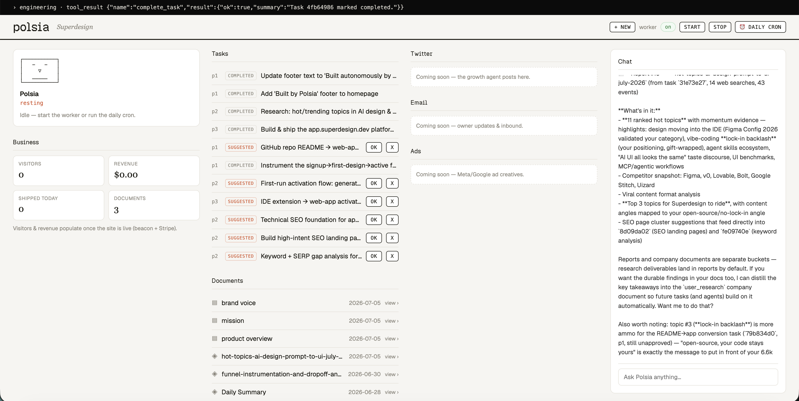

# open-polsia

**An open-source autonomous AI business-agent platform.** Give it a company idea, and a fleet of
AI agents — a CEO/planner, an engineering agent, a research agent, a chat cofounder, and an
onboarding agent — autonomously plan, build, and ship real web apps for that company on a daily
loop. Built on the [`pi` coding-agent SDK](https://www.npmjs.com/package/@earendil-works/pi-coding-agent),
TypeScript end to end, Postgres for state.

Meet **Polsia**, your AI cofounder: it maintains a task backlog, writes you a daily update, and puts
working software in front of customers — while you watch it happen in a live retro/ASCII dashboard.



```
  founder idea
       │
       ▼
  ┌─────────────┐   proposes    ┌──────────────┐   dispatch    ┌──────────────────┐
  │ CEO/Planner │ ────────────▶ │  task queue  │ ────────────▶ │ Engineering /    │
  │ (daily loop)│  (autonomy    │  (Postgres)  │  one/cycle    │ Research agent   │
  └─────────────┘    gate)      └──────────────┘               └────────┬─────────┘
       │                                                                │ builds in
       │ writes                                                         │ isolated sandbox
       ▼                                                                ▼
  daily report                                                   live URL (GitHub → Render → Neon)
```

## Quickstart

```bash
pnpm install

# Postgres for platform state:
docker run -d --name polsia-pg \
  -e POSTGRES_PASSWORD=polsia -e POSTGRES_DB=polsia \
  -p 5433:5432 postgres:16-alpine

cp .env.example .env      # then fill in ANTHROPIC_API_KEY + TAVILY_API_KEY
# (pi can also use your interactive Claude login — run `npx @earendil-works/pi-coding-agent` once and /login)

pnpm seed                 # seed a demo company (profile + docs + context)
pnpm dashboard            # live retro/ASCII dashboard → http://localhost:4317
```

Then, in separate runs:

```bash
pnpm ceo                  # one CEO/Planner cycle — plans the backlog + writes the daily report (no Docker)
pnpm ceo supervised       # proposals stay 'suggested' until you approve them in the dashboard
pnpm autopilot            # one autonomous tick: CEO plans → dispatch the top task (needs Docker)
pnpm spike "build a landing page for X"   # drive orchestrator → engineering directly (needs Docker)
pnpm test:guard           # status-integrity guard test (no LLM, no DB)
pnpm typecheck
```

Docker is only needed when an agent actually **builds** an app (the engineering agent runs its
bash/file tools inside an isolated container). Planning, research, and the dashboard run without it.

## What's inside

| Path | What |
|------|------|
| `src/agents/` | The agent roster — one file per agent (`role` + system `prompt` + its tool surface): CEO/planner, chat/orchestrator, engineering, research, onboarding |
| `src/tools/` | Runtime-agnostic `ToolDef` registry — task tools (privilege-split), sandboxed `bash`/`write_file`/`read_file`/`ls`, `deploy_app`, `web_search`/`web_fetch`, reports |
| `src/runtime/` | `AgentRuntime` — the swap seam. `PiRuntime` wraps the pi SDK today; a different backend drops in behind the same interface |
| `src/sandbox/` | `Sandbox` interface — `LocalDockerSandbox` (real `docker exec`) or the cloud `DaytonaSandbox`, same interface |
| `src/core/` | Postgres store, the task/worker loop with the never-auto-complete guard, cron dispatch, company-context memory |
| `src/platform/` | The app plane — GitHub repo per app, Render deploy, Neon Postgres provisioning, analytics beacon, per-company LLM secret proxy |
| `src/services/` | The dashboard/API (retro/ASCII UI, live queue/agents/activity, approve + autonomy toggle) |
| `templates/express-postgres/` | The Express + EJS starter the engineering agent customizes |
| `docs/` | Architecture, full tool inventory, the agent roster with system prompts, and the implementation plan |

## Key design principles

- **Privilege boundary.** The chat orchestrator can only manage the queue — it has no host shell or
  filesystem. Only the sandboxed engineering agent gets `bash`/file tools, and those run *inside* a
  container, never on the host.
- **Status integrity.** Completion is **agent-asserted**. An execution that ends without calling
  `complete_task`/`fail_task` becomes `needs_continuation` and is resumed — never silently marked done.
- **Runtime-agnostic tools.** Tools are a neutral registry adapted onto the runtime, keeping the
  agent backend swappable.
- **Bounded autonomy.** The CEO only *proposes* (a capped `suggested` backlog); an autonomy gate
  decides whether proposals auto-promote or wait for your approval. One task runs per cycle.

## Documentation

- [`docs/architecture.md`](docs/architecture.md) — the loop, runtime seam, sandbox, data model, deploy pipeline
- [`docs/tool-inventory.md`](docs/tool-inventory.md) — every tool, by agent, with parameters
- [`docs/agents.md`](docs/agents.md) — each agent's role, tools, and full system prompt
- [`docs/implementation-plan.md`](docs/implementation-plan.md) — the phased roadmap

## License

MIT — see [`LICENSE`](LICENSE).
